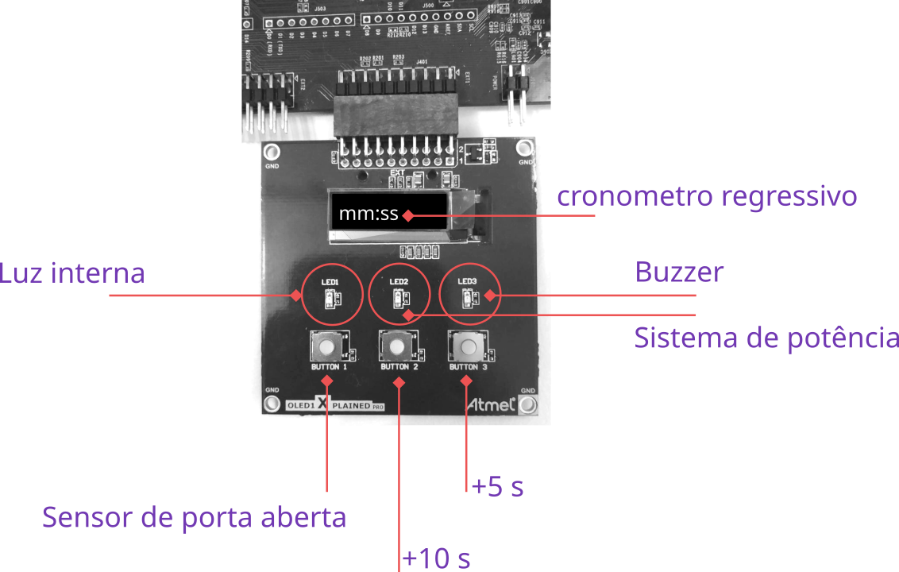

# 22a - EMB - AV1

- A prova é prática, com o objetivo de avaliar sua compreensão a cerca do conteúdo ministrado pela disciplina. 
- É permitido consulta a todo material pessoal (suas anotações, códigos) e publico (github e internet), mas não pode consultar outros alunos.
- **A cada 30 minutos você deverá fazer um commit no seu código!**
    - Códigos que não tiverem commit a cada 30min ou que mudarem drasticamente entre os commits podem ter a entrega anulada.
    - Tente inserir mensagens condizentes nos commits!
- Duração total: 3h

!!! info
    Criar o repositório de entrega pelo link:
    
    - https://classroom.github.com........

    Use como base o código disponível neste repositório.

Você vai precisar:

- ▶️ Kit SAME70-XPLD
- ▶️ Conectar o OLED1 ao EXT-1

### Ideia geral

Nesta avaliacão vocês vão desenvolver um protótipo de um controlador para um micro-ondas, que em linhas gerais irá possuir as seguintes interfaces:

- Display OLED
- Botão de +5 segundos
- Botão de +1
- 0 segundos
- Sensor de porta aberta
- Controle da luz interna 
- Sistema de potência
- Buzzer 

A seguir iremos detalhar um pouco mais como deve ser feito o protótipo e o que estará sendo avaliado.

## Micro-ondas

O funcionamento do micro-ondar é similar com qualquer outro, o usuário primeiramente precisa acrescentar um tempo utilizando os botões de `+5 segundos` ou `+10 segundos` (botões 3 e 2 do OLED). O Micro-ondas liga instantaneamente depois do tempo configurado e somente se a porta estiver fechada. Oo LED 2 da placa OLED informa que o micro-ondas está ligado. O sistema de potência deve ficar aceso pelo tempo em que o sistema ficar ligado, e deve desligar passado o tempo ou se a portar for aberta.

A seguir detalhes do funcionamento:

Requisitos funcionais:

- **Display OLED:** Exibe o tempo configurado pelo usuário, deve ser atualizado de segundo em segundo quando o micro-ondas estiver ligado. Por padrão deve exibir `00:00`.
- **Cronometro:** Deve ser o valor configurado pelo usuário, sendo que o valor máximo deve ser 60 minutos : 60 segundos. 
- **Sensor de porta aberta:** Em qualquer momento se a portar do micro-ondas for aberta o sistema de potência deve parar. Junto com ele o contador de tempo, a luz interna deve acender.
    - `OLED BUTTON 1`
    - Ação nas bordas: descida E subida
- **Botão de +10 segundos:** Adiciona 10 segundos ao cronometro, deve funcionar com o micro-ondas em operação.
   - `OLED BUTTON 2`
   - Ação na borda de descida 
- **Botão de +5 segundos:** Adiciona 5 segundos ao cronometro, deve funcionar com o micro-ondas em operação.
   - `OLED BUTTON 3`
   - Ação na borda de descida 
- **Luz interna:** É a luz interna do Micro-ondas, acesa sempre que a porta estiver aberta ou o micro-ondas ligado
    - `OLED LED 1`
- **Potência:** Indica que o micro-ondas está ligado
    - `OLED LED 2`
    - Aceso: Micro-ondas ligado
    - Apagado: Micro-ondas desligado
- **Buzzer:** Deve piscar a uma frequência de 10Hz até o usuário abrir a porta do micro-ondas ou adicionar um novo tempo.
    - `OLED LED 3`
- **Ligando o micro-ondas:** O Micro-ondas deve começar operar instantaneamente quando um valor de tempo estiver definido (t > 0s) e a porta fechada.

-------------------

🎥 ⚠️ ❗ Assista o video no youtube: https://www.youtube.com/watch?v=_OgLylrLAV4&feature=youtu.be 🎥 ⚠️ ❗

-------------------

Requisitos de software:

- Não atualiza OLED em IRQ
- Todos os botões com IRQ
- Lógica implementada na função main
- Usar TC com 1hz para a contagem do cronometro
- Usar TC para fazer o buzzer piscar após o fim do tempo

## Extras

- Código estruturado em funções.
- Cancelar: Apertar os dois botões (+10 e + 5) ao mesmo tempo limpa o valor do cronometro.
- O micro-ondas liga somente apos passado 3 segundos da configuração de um novo tempo (usar RTT).
- Luz interna fica acesa por 15 segundos após o fim do tempo
- Incremento rápido quando os botões ficarem pressionados
